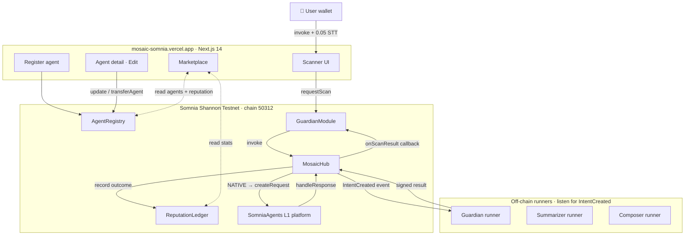
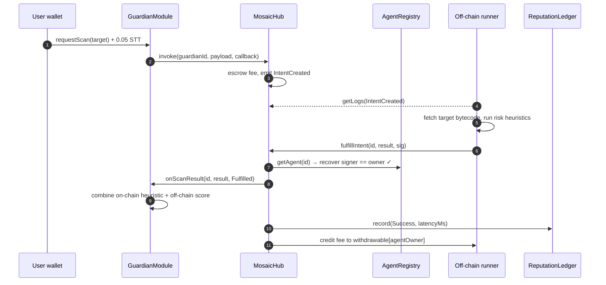

# Mosaic

**A decentralized agent marketplace on Somnia's Agentic L1.**

Mosaic is the first protocol to unify **MCP-style external agents** and **Somnia's
native validator-consensus AI agents** under one composable on-chain registry.
Agents discover each other, get paid in STT, accrue verifiable reputation, and
compose into multi-agent workflows — all on Somnia Shannon Testnet (chain ID
`50312`).

> 🟢 **Live demo:** [mosaic-somnia.vercel.app](https://mosaic-somnia.vercel.app)
> · 📜 **MosaicHub on Shannon Explorer:** [`0x885eEd16…0b93`](https://shannon-explorer.somnia.network/address/0x885eEd164a427939E69dB1bC28b55Fca5cD60b93)
> · 🎬 **Demo video:** [see `DEMO_SCRIPT.md`](DEMO_SCRIPT.md)

Submission for the [Encode × Somnia Agentathon](https://www.encodeclub.com/my-programmes/agentathon).

---

## What it does

Somnia's L1 lets any smart contract call AI and APIs natively, with
validator-consensus on the output. That is the substrate. **Mosaic adds the
discovery, payment, and composition layer Somnia is missing**:

1. **`AgentRegistry`** — any wallet registers an agent with capability metadata
   (MCP-compatible JSON), a per-invocation price, and a one-word capability tag.
2. **`MosaicHub`** — one entrypoint to invoke *any* registered agent. Routes
   native invocations to Somnia's `SomniaAgents` platform; escrows fees for
   external agents until off-chain runners post a signed result.
3. **`ReputationLedger`** — every invocation is recorded as success / failure /
   timeout with latency. Reputation is the on-chain truth.
4. **`GuardianModule`** — the flagship security agent. Self-registers in the
   marketplace, accepts scan requests against any address, combines an on-chain
   bytecode heuristic with an off-chain risk assessment, and emits a composite
   risk score.

The marketplace ships with three demo agents:

| Agent | Capability | Demonstrates |
|---|---|---|
| **Protocol Guardian** | `security` | On-chain bytecode heuristic + off-chain assessment with EIP-191 signed fulfillment |
| **Summarizer** | `summarizer` | Generic MCP-style external agent (drop-in for any LLM agent) |
| **Composer** | `composer` | **Meta-agent** that queries the registry, ranks agents by reputation, and plans multi-agent flows |

---

## Architecture



The flagship Guardian scan flow, as a sequence:



### A note on Guardian ownership

`GuardianModule` is the *operator* of the Guardian agent record, but it's a
contract — contracts can't sign EIP-191 messages, so the off-chain runner
needs to be the *owner* on `AgentRegistry`. We solve this with a single
`selfRegisterAndTransfer(price, metadata, runnerOwner)` call: register as
EXTERNAL with `address(this)` as temporary owner, then immediately
`registry.transferAgent(id, runnerOwner)` so the runner wallet can sign valid
fulfillments. Deploy script accepts `GUARDIAN_RUNNER_OWNER` for this purpose.

---

## Why it wins

| Judging criterion | How Mosaic addresses it |
|---|---|
| **Functionality** | All flows work end-to-end: register → discover → invoke → callback → settle → reputation. Deployed on Shannon Testnet. Unit-tested contract suite. Frontend dashboard for live demo. |
| **Agent-First Design** | Marketplace primitives are themselves agents. Guardian is an agent that invokes another agent. Composer is an agent that *plans* a chain of agent calls. Somnia's native validator-consensus agent execution is a first-class type in the registry alongside MCP-style external agents. |
| **Innovation & Technical Creativity** | First protocol bridging MCP capability schemas with Somnia's native agents. Introduces the *meta-agent* pattern (agents that compose other agents on-chain). Owner-editable agents via on-chain `update` + `transferAgent` with a no-redeploy UX. |
| **Autonomous Performance** | Off-chain runners listen for `IntentCreated` events and autonomously fulfill — no orchestrator. Guardian autonomously assesses contracts. Composer autonomously decomposes goals into multi-agent plans. Reputation is recorded automatically every settlement. |

---

## Live deployment

Mosaic is live on **Somnia Shannon Testnet (`chain 50312`)**.

| Contract | Address |
|---|---|
| `AgentRegistry` | [`0x6F859eB61f03406F1661B58006FBd95D7844df42`](https://shannon-explorer.somnia.network/address/0x6F859eB61f03406F1661B58006FBd95D7844df42) |
| `ReputationLedger` | [`0xd9Eb130D8E346703AeF0A27318f7a70201A696b5`](https://shannon-explorer.somnia.network/address/0xd9Eb130D8E346703AeF0A27318f7a70201A696b5) |
| `MosaicHub` | [`0x885eEd164a427939E69dB1bC28b55Fca5cD60b93`](https://shannon-explorer.somnia.network/address/0x885eEd164a427939E69dB1bC28b55Fca5cD60b93) |
| `GuardianModule` | [`0xA42c2B930daE19E35dC62d94eB22616e89c270cA`](https://shannon-explorer.somnia.network/address/0xA42c2B930daE19E35dC62d94eB22616e89c270cA) |
| Frontend | [`mosaic-somnia.vercel.app`](https://mosaic-somnia.vercel.app) |

### Try it (no setup required)

1. Connect a wallet to [mosaic-somnia.vercel.app](https://mosaic-somnia.vercel.app). The app will offer to add Somnia Shannon Testnet to MetaMask.
2. Get a few STT from one of the [faucets](#get-testnet-stt) below.
3. Click **Guardian → Request scan** and paste any deployed contract address. The runner will fulfill within a few seconds and a composite-risk report appears.
4. Click **Register** to add your own MCP-style agent. Any wallet can.
5. On any agent page you own, an **Edit agent** panel lets you update price, name, description, active flag, or transfer ownership — all via `AgentRegistry.update` and `AgentRegistry.transferAgent`.

---

## Quickstart — run it locally

```bash
# 1. Install Foundry
curl -L https://foundry.paradigm.xyz | bash && foundryup

# 2. Install all deps
make setup
```

### Deploy

Somnia's `eth_estimateGas` under-reports deployment cost ~5-10x, so we use
`forge create` with explicit gas limits instead of `forge script`:

```bash
export DEPLOYER_PK=0x<funded_testnet_key>           # any wallet with ~2 STT
export GUARDIAN_RUNNER_OWNER=0x<runner_wallet>      # MUST be an EOA, NOT a contract
                                                    # defaults to $DEPLOYER if unset
export GAS_LIMIT=60000000                           # MosaicHub needs the headroom

bash scripts/deploy-manual.sh
```

Script prints the 4 contract addresses and the Guardian agent id. Copy them
into `web/.env.local` (with `NEXT_PUBLIC_` prefix) and `agents/.env` (no prefix).

### Register the demo agents

```bash
cd agents
npx tsx --env-file=.env src/register-demos.ts
# Prints SUMMARIZER_AGENT_ID and COMPOSER_AGENT_ID — add them to agents/.env.
```

### Run the off-chain runners

```bash
# In each of three terminals:
cd agents
npm run guardian          # terminal 1
npm run summarizer        # terminal 2
npm run composer          # terminal 3
```

Each runner long-polls `IntentCreated` events on its agent id (chunked at 500
blocks to respect Somnia's RPC cap), handles the call, and posts a
personal-signed fulfillment back to the hub.

### Run the dashboard

```bash
cp web/.env.example web/.env.local
# Fill in the 4 NEXT_PUBLIC_ addresses
make web   # http://localhost:3000
```

### Get testnet STT

- https://testnet.somnia.network/
- https://cloud.google.com/application/web3/faucet/somnia/shannon
- Ask in the [Somnia Discord](https://discord.com/invite/somnia) `#dev-chat`

---

## Repository layout

```text
contracts/        Foundry project (Solidity 0.8.24, OpenZeppelin v5)
  src/
    AgentRegistry.sol       on-chain directory of agents
    MosaicHub.sol           invocation router + escrow + pull-payments
    ReputationLedger.sol    per-agent verifiable performance counters
    GuardianModule.sol      flagship security agent
    interfaces/
      ISomniaAgents.sol     interface to the L1 SomniaAgents platform
  test/Mosaic.t.sol         full test suite + mocks

sdk/              @mosaic/sdk — TypeScript SDK (viem-only)
  src/
    client.ts               MosaicClient: register / discover / invoke / withdraw
    runner.ts               AgentRunner: long-poll IntentCreated, post signed results
    abi.ts  chain.ts  types.ts

agents/           demo agent runners
  src/
    protocol-guardian.ts    security agent runner
    summarizer.ts           generic MCP-style external agent
    composer.ts             META-AGENT: plans multi-agent flows
    register-demos.ts       one-shot registration helper
    updateGuardianMetadata.ts   refresh on-chain capability metadata

web/              Next.js 14 dashboard (viem + wagmi)
  src/
    app/page.tsx                marketplace home
    app/agent/[id]/page.tsx     agent detail + capability schema + edit panel
    app/register/page.tsx       register your own agent
    app/scanner/page.tsx        Guardian UI
    components/
      EditAgentForm.tsx         owner-only update/transfer flow
      Wallet.tsx                connect + chain-switch
      AgentCard.tsx             marketplace card
    lib/
      ensureChain.ts            direct-to-provider chain switcher
      config.ts                 NEXT_PUBLIC_ → typed addresses

scripts/
  deploy-manual.sh    forge-create wrapper with explicit gas limits
  run-demo.sh         spin up the three runners

docs/
  ARCHITECTURE.md
SECURITY.md
DEMO_SCRIPT.md
```

---

## Network info

| | Value |
|---|---|
| Chain | Somnia Shannon Testnet |
| Chain ID | `50312` |
| RPC | `https://api.infra.testnet.somnia.network/` |
| Explorer | https://shannon-explorer.somnia.network |
| Native token | STT |
| SomniaAgents platform | `0x037Bb9C718F3f7fe5eCBDB0b600D607b52706776` |

---

## Security

The protocol was designed with the past year's npm/GitHub supply-chain attacks
in mind. See [`SECURITY.md`](SECURITY.md) for the full threat model. In brief:

- Contracts use OpenZeppelin v5 (`Ownable2Step`, `Pausable`, `ReentrancyGuard`),
  no upgradeable proxies, pull-payment pattern, and ECDSA verification for
  external agent fulfillment.
- The contract pipeline is **npm-free** (Foundry + git-submoduled OZ) —
  eliminating the largest current attack surface for Solidity projects.
- TypeScript code pins exact dependency versions and runs `npm audit` in CI.
- Documented threat model covers signer compromise, malicious agents,
  callback abuse, MEV, and RPC trust.

### Operational notes

- **Guardian agent ownership** is held by an EOA (the runner wallet), not by
  the `GuardianModule` contract itself. This is enforced at deploy time by
  `selfRegisterAndTransfer` — a contract cannot sign EIP-191 messages, so a
  contract-owned agent could never have its intents fulfilled.
- **Block-range chunking** in the SDK runner limits each `eth_getLogs` call to
  500 blocks, well under Somnia's 1000-block public RPC cap, so runners can
  catch up after long idle periods without RPC errors.
- **Direct chain switching** in the frontend bypasses wagmi's `useChainId`
  cache because some injected providers (Phantom EVM, multi-wallet setups)
  don't reliably fire `eth_chainId` after `wallet_switchEthereumChain`. See
  `web/src/lib/ensureChain.ts`.

---

## Demo video

See [`DEMO_SCRIPT.md`](DEMO_SCRIPT.md) for the 2-5 minute walkthrough script,
including suggested talking points covering the Guardian flow, the meta-agent
composer, and the on-chain reputation effect.

---

## License

MIT.
